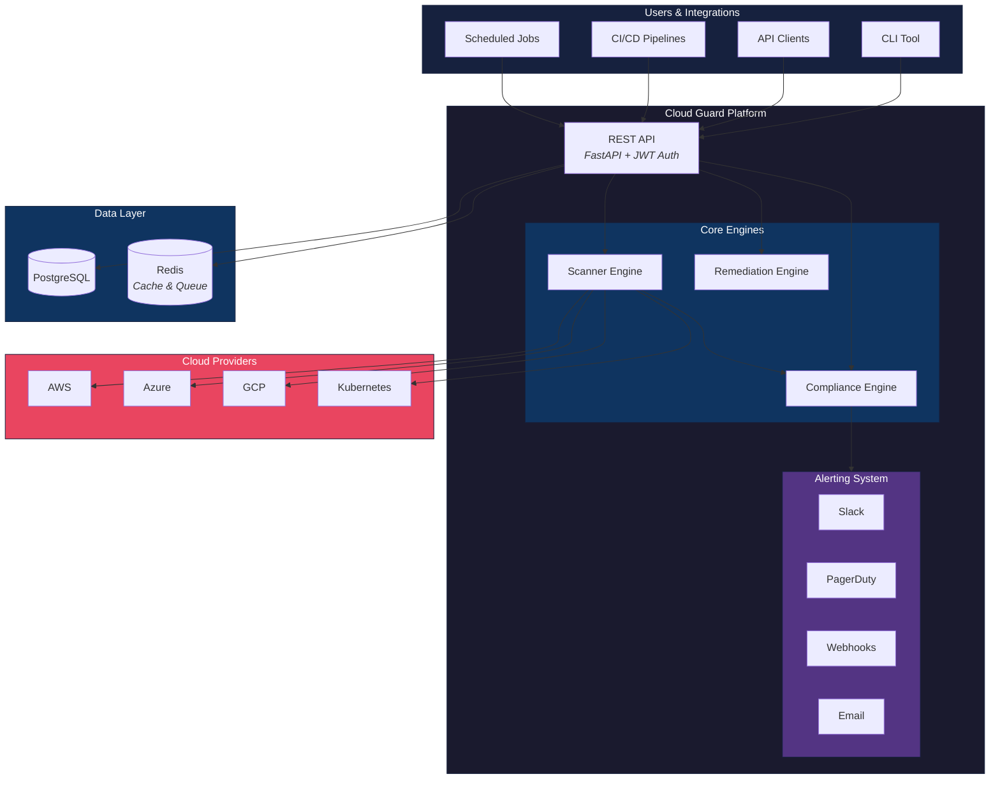
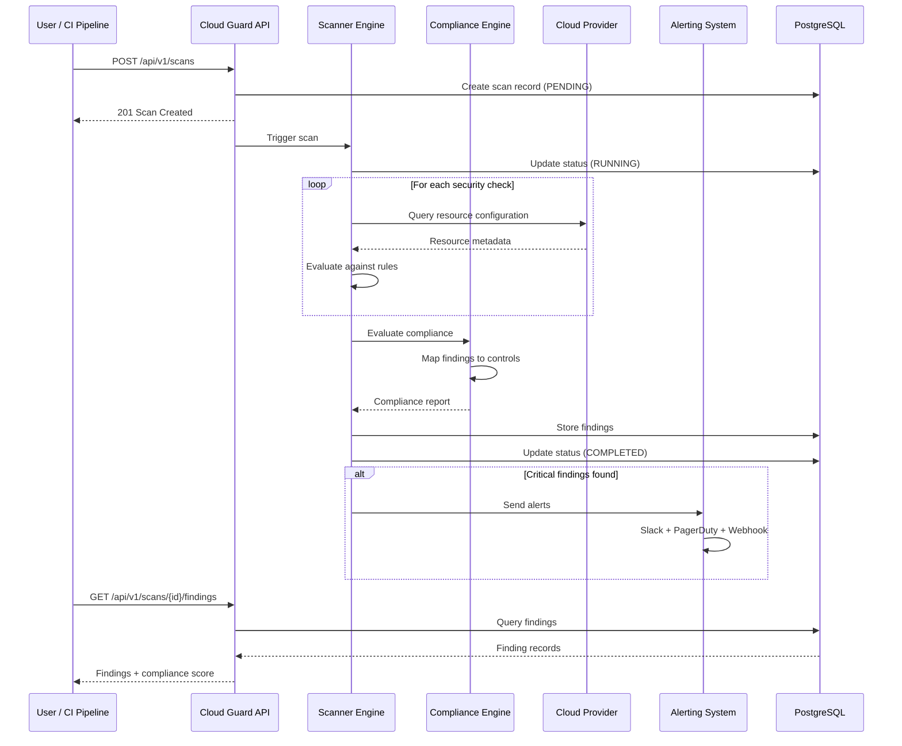
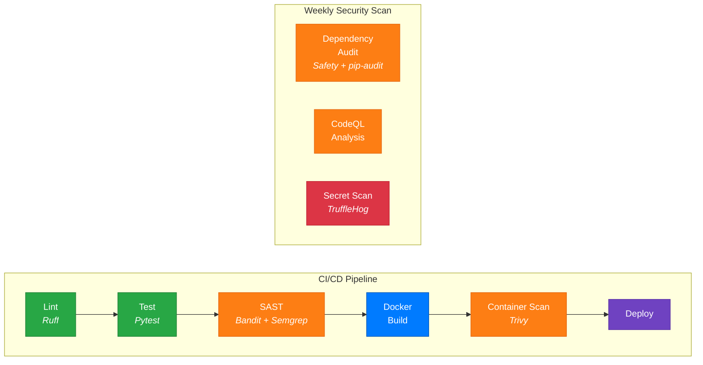
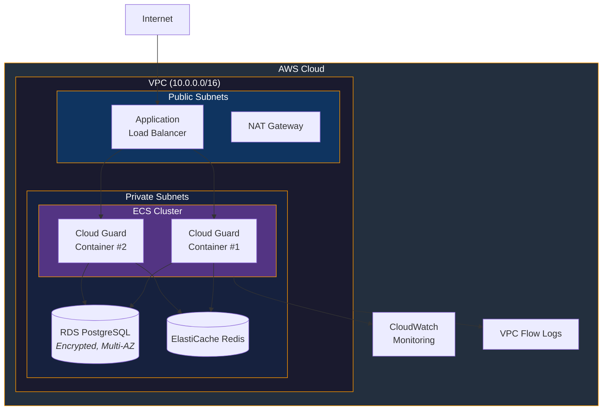
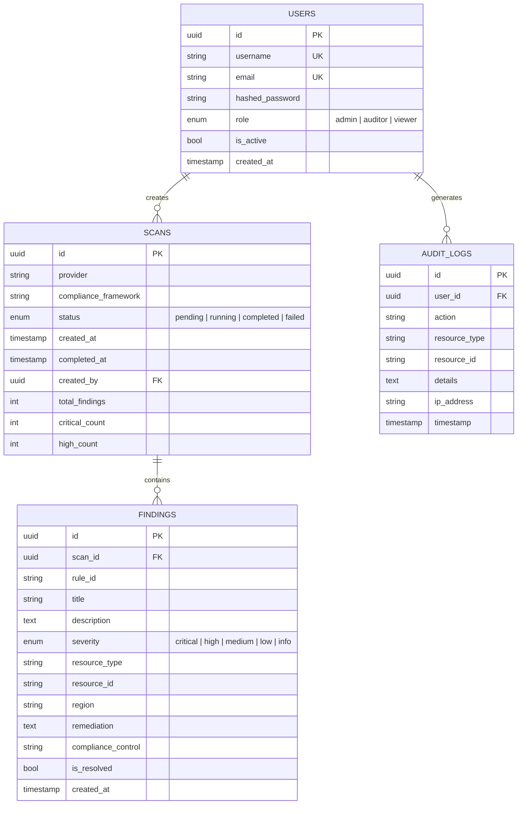

# ☁️ Cloud Guard — Cloud Security Posture Management Platform

[](https://github.com/osamacs7/cloud-guard/actions/workflows/ci.yml)
[](https://github.com/osamacs7/cloud-guard/actions/workflows/security.yml)
[](https://opensource.org/licenses/MIT)
[](https://www.python.org/downloads/)

**Cloud Guard** is an enterprise-grade Cloud Security Posture Management (CSPM) platform that continuously monitors your cloud infrastructure for security misconfigurations, compliance violations, and threat indicators across AWS, Azure, and GCP.

## Architecture

### System Overview



### Scanning Flow



### CI/CD Security Pipeline



### Infrastructure Deployment



### Data Model



## Features

- **Multi-Cloud Scanning** — Audit AWS, Azure, GCP, and Kubernetes for misconfigurations
- **Compliance Frameworks** — CIS Benchmarks, NIST 800-53, SOC 2, PCI-DSS, HIPAA, ISO 27001
- **Real-Time Alerting** — Webhook, Slack, PagerDuty, and email notifications
- **Policy-as-Code** — Define custom security policies in YAML/Rego
- **REST API** — Full API with OpenAPI docs for integration into CI/CD pipelines
- **RBAC** — Role-based access control with JWT authentication
- **Audit Logging** — Immutable audit trail for all actions
- **Scheduled Scans** — Cron-based automated scanning
- **Remediation Playbooks** — Automated and guided remediation for common findings
- **Extensible Plugin System** — Write custom scanners and compliance checks

## Quick Start

### Prerequisites

- Python 3.11+
- Docker & Docker Compose
- Cloud provider credentials (AWS/Azure/GCP)

### Installation

```bash
# Clone the repository
git clone https://github.com/osamacs7/cloud-guard.git
cd cloud-guard

# Start with Docker Compose
docker compose up -d

# Or install locally
pip install -e ".[dev]"
cloud-guard init
cloud-guard scan --provider aws --profile default
```

### Configuration

```bash
cp .env.example .env
# Edit .env with your settings
```

### Run a Scan

```bash
# Scan AWS infrastructure
cloud-guard scan --provider aws --compliance cis-aws-1.5

# Scan Kubernetes cluster
cloud-guard scan --provider k8s --kubeconfig ~/.kube/config

# Generate compliance report
cloud-guard report --format pdf --framework nist-800-53
```

## API Usage

```python
import requests

# Authenticate
token = requests.post("http://localhost:8000/api/v1/auth/login", json={
    "username": "admin",
    "password": "changeme"
}).json()["access_token"]

# Trigger a scan
scan = requests.post(
    "http://localhost:8000/api/v1/scans",
    headers={"Authorization": f"Bearer {token}"},
    json={"provider": "aws", "compliance_framework": "cis-aws-1.5"}
).json()
```

## Project Structure

```
cloud-guard/
├── src/cloud_guard/
│   ├── api/              # FastAPI routes and middleware
│   ├── core/             # Core framework (config, auth, logging)
│   ├── scanners/         # Cloud provider scanners
│   ├── compliance/       # Compliance framework engines
│   ├── alerting/         # Notification integrations
│   ├── models/           # SQLAlchemy models
│   ├── policies/         # Policy-as-code definitions
│   └── remediation/      # Automated remediation playbooks
├── tests/                # Unit, integration, and e2e tests
├── policies/             # Custom policy definitions (YAML)
├── docker/               # Docker and compose files
├── helm/                 # Kubernetes Helm chart
├── terraform/            # Infrastructure as Code
├── .github/workflows/    # CI/CD pipelines
└── docs/                 # Documentation
```

## Development

```bash
# Install dev dependencies
pip install -e ".[dev]"

# Run tests
pytest --cov=cloud_guard

# Linting
ruff check src/ tests/
ruff format src/ tests/

# Type checking
mypy src/

# Security scanning
bandit -r src/
safety check
```

## Deployment

See [docs/deployment.md](docs/deployment.md) for production deployment guides including:
- Docker Compose (single node)
- Kubernetes with Helm
- Terraform for cloud infrastructure

## Contributing

See [CONTRIBUTING.md](CONTRIBUTING.md) for guidelines.

## License

MIT License — see [LICENSE](LICENSE) for details.
